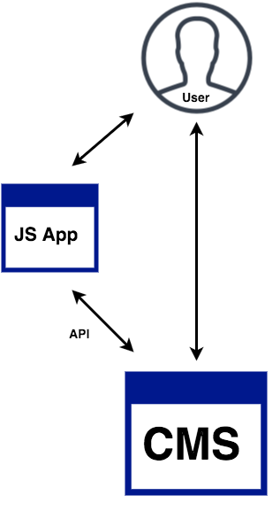
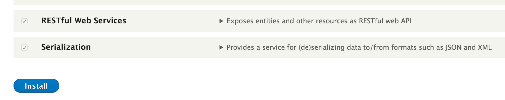
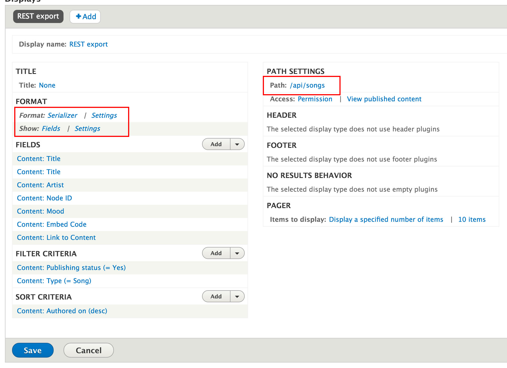
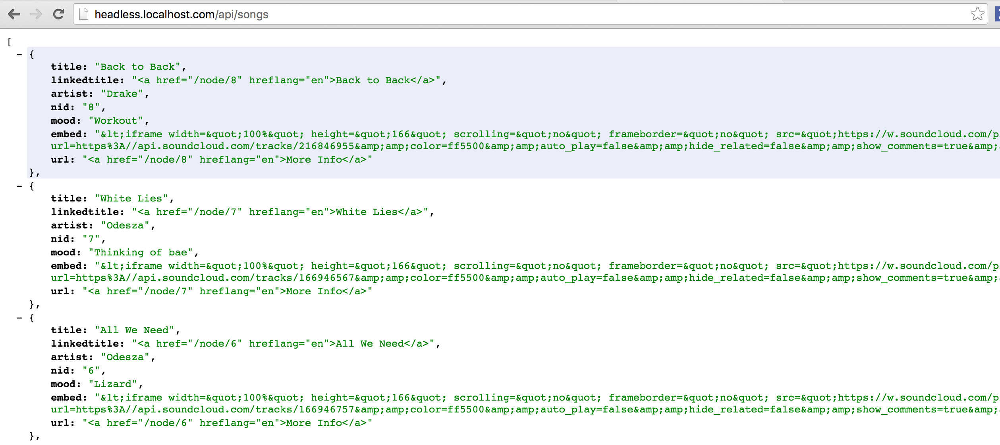
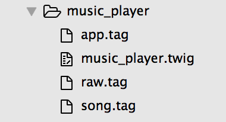
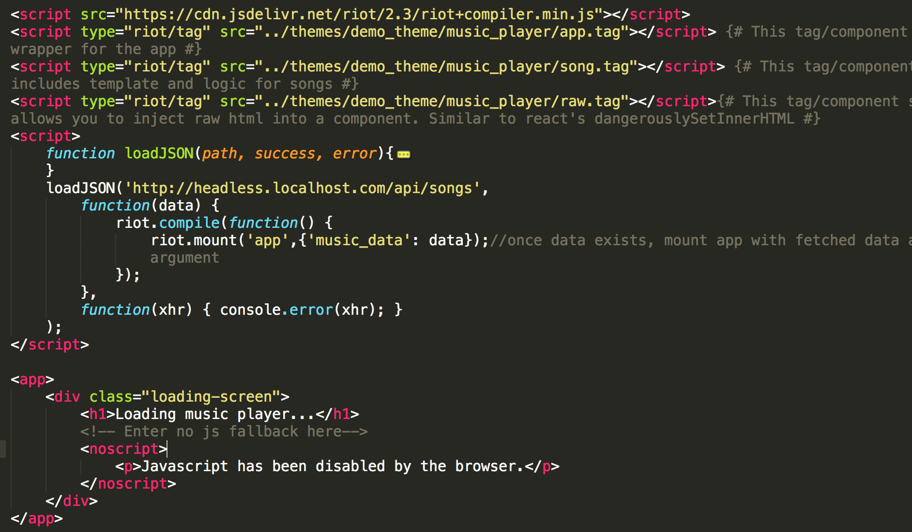
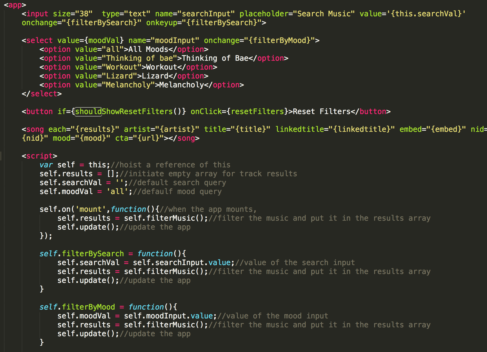
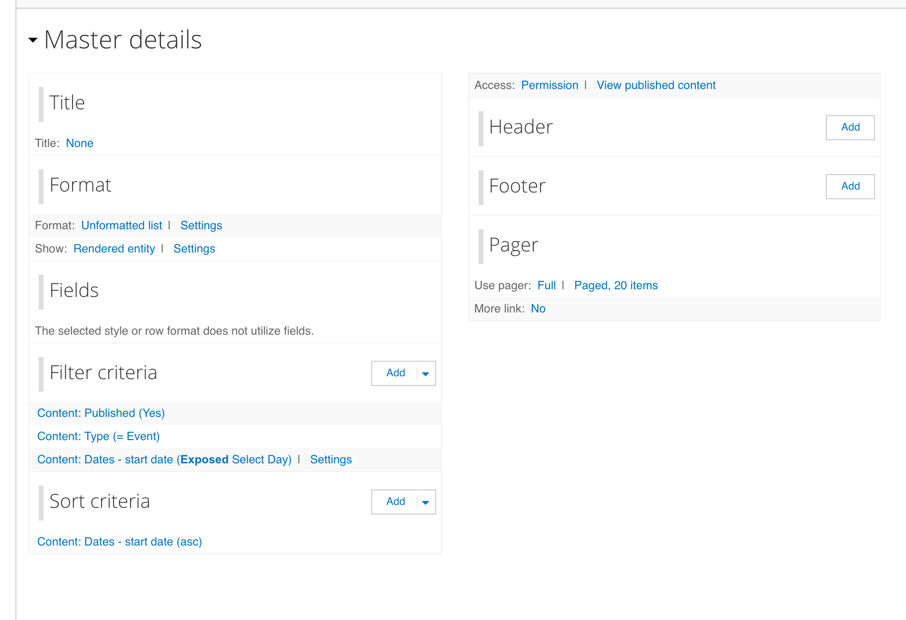
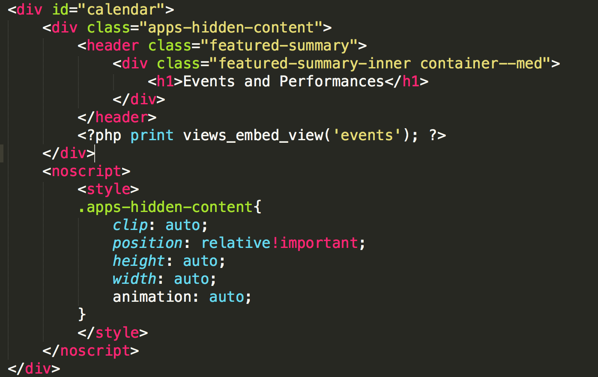
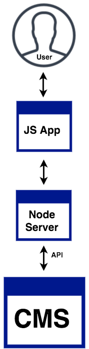

# Beheading Drupal...

#####Alternate title: Drupal, a love story

### Will Vedder

^Really excited to give this talk

^Genuinely enjoy

^Been working with Drupal many years

^Headless work the last 1.5 years

^Lots of new, exciting stuff happening in the JS world

^Headless architectures open up lots of possibilities

^These are just my experiences

---

# Williamson Vedder :whale2:
###Developer @ Bluecadet
###Adjunct @ Drexel, Temple

^So who am I?

^Bluecadet is an Emmy Award-winning digital agency that creates world-class websites, mobile apps, interactive installations, and immersive environments.

---
#Agenda

- Explore types of headless builds (w/examples)

- Emphasize a particular approach

- D8 headless walkthrough

- Personal takeaways (caching, server-side render, SEO)

---

#🤔

^Who here has implemented a headless setup?

^...with success?

---

#Headless/Decoupled Drupal

Hard separation between theming layer and rest of CMS. Drupal feed raw data to a front-end framework like React or Angular.

^Quick definition

^Drupal sends mostly raw data

^Front-end framework consumes data and generates html

^Headless = decoupled

---

#Many Types of Headless Implementations

-Fully Decoupled

-Hybrid

-CMS to CMS

-CMS to Node.js

-CMS to Node.js to Caching service

-Many more...

^Comes in many flavors

^This talk will be focusing on the first two

---

#None (traditional)

No hard separation. Drupal handles data processing and theming. 

Think: most Drupal sites now. Business as usual.

^For the sake of comparison

---
#None (traditional) pros :thumbsup:

- Likely already pretty good at it

- Everything under the hood already

---
#None (traditional) cons  :thumbsdown:

- Slow and expensive async interactions

- Often difficult to customize markup of UI elements

- Modules are usually great but difficult to extend

- Modules blur data-theming line 

---

#Fully Decoupled

Full separation between data layer and front-end layer. 

Think: Single page apps (SPAs).

---

####hoovermason.com

^Responsive webapp

^City of Bethlehem

^Touring the evelated walkway of old steel mill ruins

^Wordpress and Angular 1

^Completely custom experience

^Traditional architecture wouldn't have made sense

---

#Fully decoupled pros :thumbsup:
- Snappy interactions via client side rendering 

- Fully customizable interfaces/markup 

- Easily swappable front-end/back-end

- Security, _generally_ :lock:

---

#Fully decoupled cons :thumbsdown:

- Missing out on some of Drupal's best features

- SEO and crawler drawbacks, _generally_

- Another framework to learn, develop,maintain

- Complexity of hosting, _generally_

- JS reliance, _generally_

^Editing in-place, menu system, routing, built-in login, built-in search, built-in 404/403. All things you’d need to rebuild.d

^Initial bootstrap for frameworks on mobile sooo slow

^Sometimes the web isn't perfect perfect

^Lots of mobile browses still have trouble with JS

^Proxy browsers, opera mini etc.

---

#Doesn't need to be all or nothing

###You can leverage the strength of both :muscle:

---

#Hybrid

Some sections of site are separated for responsive interfaces, Drupal handles rest of the theming. 

Think: dashboards, calculators.

---

#Hybrid Breakdown

1. User requests page
2. Server responds
3. App bootstraps
4. App requests api
5. CMS responds
6. App parses data, renders view
7. Repeat steps 4-6

^To 

^HTTP Response is the container for the app to be served, step 3 cannot occur until step 2 has completed

^The meat of this talk focuses on steps 4-5

---

---

^Two view modes, decoupled makes it esasy,same data

---

---
#Hybrid pros :thumbsup:

- Speedy interfaces via JS as needed,
- Sturdy Drupal rendering when not
- Basically, upsides of both
- Rollout in stages
- Isolated app development

^Isolated app development might work well with workflow,
^Teamsize
^"not stepping on each others toes"

---
#Hybrid cons :thumbsdown:

- Still requires another framework to learn,develop,maintain
- SEO and crawler downsides (avoidable)

---

#Remaining Agenda:

- D8 Walkthrough (everything under the hood :raised_hands:)

- What I wish I knew about hybrid-headless approach

- API Caching

- Server-side rendering (for SEO,crawlers) 🤖

---

#🤔

^Who here is using D8?

^...with success?

---

#D8 Walkthrough: Gameplan

- Easy site-building
- Enable an included module
- Create a view -> your api
- Create custom template
- Create your app
- Put app into custom template

^Riot.js app, react-like

^Straightforward syntax and architecture

---

#D8 Walkthrough: First steps

- Clean install
- Duplicate Bartik for custom theme
- Create "Music Player" basic page
- Created "Song" content type:
    - Artist
    - Embed code
    - Mood :smirk:

---

#Hybrid Review

1. User requests page
2. Server responds
3. App bootstraps
4. App requests api
5. CMS responds
6. App parses data, renders view
7. Repeat steps 4-6

^HTTP Response is the container for the app to be served, step 3 cannot occur until step 2 has completed

^The meat of this talk focuses on steps 4-5

---

#Demo: create your api

^Working backwards from the data model 

---

#D8 Walkthrough: enable RestFul Web Services module

---

#D8 Walkthrough: create a view

---

#Demo: check out your amazing api

---

#Demo: including app into template

^ Show TPL and Music player app embedded, create diagram

---

#Demo: adding to your template

---

#Demo: your app include

---

#Demo: the app component

---

#Demo: the app component

---

---
#Personal takeaways 
###of the hybrid-headless approach

#:hushed:
 
^ A disclaimer

^ Not going to stand up here and tell you how to structure your API

---
#API Reflections:

- Serve up all data at once (if possible)

- Reduce asynchronous requests (if possible)

- Drupal's schema doesn't lend itself to api creation

- Many ways to create apis in Drupal

	- I prefer using a custom module + menu hook

---

#API Caching :key:

- Very important, especially for scaling

- Doesn't need to be complicated either

- Built-in page caching already working for you

- Easy to extend with Drupal's built-in caching functions (some assembly required)

---

#API Caching Implementation

- Set cache after expensive query

- Clear _and_ rebuild cache on content update, insertion, Cron jobs

- Certainly opt for more performance with changes to stack

---

#Basic API Caching

^Keen observers might say "Cache _is_ in the db", that's correct. The DB in this diagram reps expensive query

---

#Basic API Caching w/Varnish

^Keen observers might say "Cache _is_ in the db", that's correct. The DB in this diagram reps expensive query

---

#API Caching Results 🤓

n = 10, 600+ nodes w/17 fields each, 46kb

---

#Server Side Rendering (initial render)

1. User requests page
2. Server responds
3. ~~App bootstraps~~
4. ~~App requests api~~
5. ~~CMS responds~~
6. ~~App parses data, renders view~~
7. Repeat steps 4-6

^
----
#Server-side rendering

- Markup is generated for initial render

- Client handles subsequent renders

- Not waiting for JS framework bootstrap :fire:

- SEO and crawler benefits 🤖

^Remember when I mentioned server side rendering earlier?

^SSR is big deal

^React, Angular2, riotjs and more frameworks support this now

^Talk doesn't do it justice

----

#Server-side rendering implementation

- Simple solution? Use a view

- More robust solution? Add a node server in your stack

^Personally never implemented second option, modern frameworks offer it, typically run on node server

^Limited hosting resources? Simple solution not bad

^Due to limited time and resources, went with a view

___

###Server-side rendering: simple

___

###Server-side rendering: simple

---

###Server-side rendering: simple

___

#Server-side rendering: more robust

---

^All together now

----
#Takeaways  :sunglasses:

The headless approach isn’t about following the trend and applying it haphazardly. It’s about engineering a product using the best of a coupled and decoupled approach that can leverage the power of all the tools and skills at your disposal.  

^Quick thanks
^Shoutout to Matt Cheney @Pantheon for diagrams and inspiration
^Special to Mark Llobrera for helping put together

---

#Takeaways  :sunglasses:

...but with that said, the hybrid approach has yielded some of the best results. Excited to see more folks using it and create cool things.

^Since it's not all or nothing, there's little investment and you can start using it on your site today.

----

#Presentation/demo files

###[github.com/willvedd/drupaldelphia-headless-demo](https://github.com/willvedd/drupaldelphia-headless-demo)
